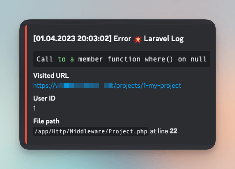
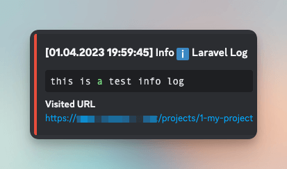

# Laravel Logger - Discord Channel (updated frequently)
###### A Discord based Monolog driver for Laravel
[](https://packagist.org/packages/dyanakiev/laravel-logger-discord-channel) [](https://packagist.org/packages/dyanakiev/laravel-logger-discord-channel) [](https://packagist.org/packages/dyanakiev/laravel-logger-discord-channel) [](https://packagist.org/packages/dyanakiev/laravel-logger-discord-channel) [](https://packagist.org/packages/dyanakiev/laravel-logger-discord-channel) [](https://packagist.org/packages/dyanakiev/laravel-logger-discord-channel)

## Install
```bash
composer require dyanakiev/laravel-logger-discord-channel

```

## Usage

1. Add the new discord channel type in your `config/logging.php` configuration file, find the channels section and add the discord array within

```php
'channels' => [
        'discord' => [
            'driver' => 'custom',
            'via' => dyanakiev\LoggerDiscordChannel\DiscordLogger::class,
            'suffix' => env('DISCORD_LOG_SUFFIX','Laravel Log'), // Message title suffix
            'webhook' => env('DISCORD_LOG_WEBHOOK', false), // e.g. https://discordapp.com/api/webhooks/...
            'level' => env('DISCORD_LOG_LEVEL', 'debug'), // You can choose from: emergency, alert, critical, error, warning, notice, info and debug
            'context' => env('DISCORD_LOG_CONTEXT', false), // Enable this if you want to receive the full context of an error, usually useless
            'environment' => env('DISCORD_LOG_ENVIRONMENT', 'production'), // Enable logging only for environment ['production', 'staging', 'local']
            'message' => env('DISCORD_LOG_MESSAGE', false), // Here you can put extra message or tag role or person via @personName
        ],
],
```
2. Add the new discord channel inside the `stack` channel, its recommended to set `LOG_CHANNEL` to `stack` so you can still have your daily logs when running in production
3. Customize the package settings either directly in the config or in the .env file

## Note
You may need to clear cache after installation if you get `laravel.EMERGENCY: Unable to create configured logger. ... Log [discord] is not defined.` with
```bash
php artisan config:clear
```
Dont forget to cache the config again after clearing cache if ran on production :)
```bash
php artisan config:cache
```

## Example logs


